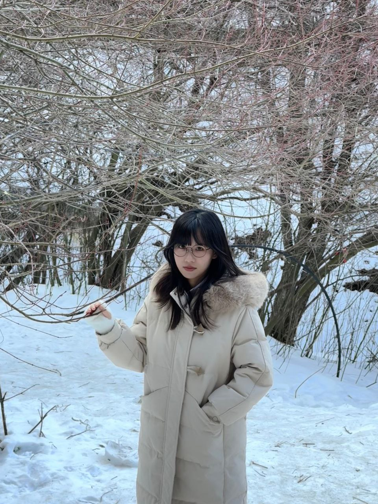

# Han Wang  

## 🔗 Navigation
[Home](index.md) | [Publications](publications.md) | [CV](cv.md) | [Contacts](contacts.md)

**PhD Year 3 Student**  

I am a third-year PhD student at the Singapore University of Technology and Design (SUTD), supervised by Dr. Roy Ka-Wei Lee. My research focuses on multimodal AI and AI for social good. I joined SUTD in 2018 under the Senior Middle 2 (SM2) Scholarship, completed my bachelor’s degree in 2022 with the Top Student Award, and subsequently worked as a research assistant before starting my PhD in 2023. My work explores multimodal understanding for social applications, and I have interned at Tencent (2025) and published or submitted papers to venues including ACM MM, WWW, IJCAI, and AAAI. Currently, I aim to explore fundamental models for multimodal understanding.

✨ **Current Plan:** Seeking collaborations and visiting scholar opportunities in streaming video understanding and Video-LLMs. Please feel free to reach out via email.

---

### 📢 News
- **2025** – Research intern at Tencent; submitted a paper to AAAI.  
- **2025** – Paper accepted at ACM MM and WWW.  
- **2024** – Paper accepted at ACM MM and WWW.  
- **2023** – Papers accepted at IJCAI and ACM MM; started PhD at SUTD.
- **2022** – Joined Dr. Roy Ka-Wei Lee’s group at SUTD; graduated with Top Student Award.  
- **2018** – Awarded Senior Middle 2 (SM2) Scholarship.
